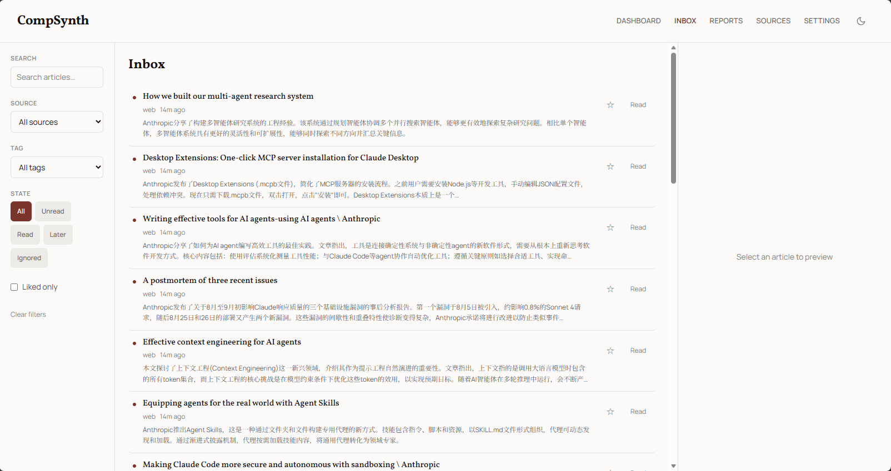
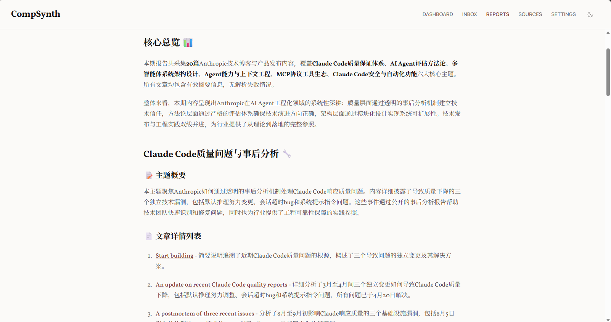

# CompSynth

**一天内容，一网打尽。**

本地内容聚合与发布系统。抓取 RSS、Web（静态/JS渲染）内容，通过 LLM 生成摘要，输出 Markdown 日报。

[](https://www.python.org/) [](https://fastapi.tiangolo.com/) [](https://react.dev/) [](https://www.typescriptlang.org/) [](https://crawlee.dev/python/)
[](https://github.com/ADchampion3/CompSynth/stargazers)

[Website](https://github.com/ADchampion3/CompSynth)  · [Contributing](CONTRIBUTING.md)

---

## 为什么是 CompSynth？

**CompSynth** = **Comp**osition + **Synth**esis

名字源于它的核心能力：将多个来源的内容组合（compose）成一份综合摘要（synthesize）。对于追踪技术博客和资讯的研究人员、工程师而言，这是一款本地优先的工具——数据留在本地，配置通过 YAML 管理，不需要注册账号。

<p align="center">
  
</p>
<p align="center">
  
</p>

<video src="docs/assets/display.mp4" width="800" controls></video>

**注意**: 这不是一个知识库, 只是一个方便用户检查信息是否更新以及对更新信息有一个大致的了解和便于追踪到信息原文的工具

## 功能

- **多源抓取** — RSS、Web（静态）、JavaScript 渲染页面（Crawlee 驱动）
- **智能去重** — SQLite 实现持久化去重
- **HTML 预处理** — 3 层清洗管线（压缩 → 深度清理 → 属性剥离），提高 Selector 有效性
- **LLM 摘要** — 支持 OpenAI 和 Anthropic 兼容 API
- **Web UI** — 收件箱、订阅源管理、文章阅读
- **选择器编辑器** — CSS 选择器 + LLM 辅助重提取
- **邮件推送** — SMTP 自动检测，Markdown→HTML，`compsynth notify` 独立发送
- **后端配置同步** — 设置页面直接修改，无需重启

---

## 快速安装

```bash
git clone https://github.com/ADchampion3/CompSynth.git
cd CompSynth
uv sync
```

> **验证安装**
>
> ```bash
> uv run compsynth --version
> # compsynth 0.1.0
> ```

### 安装为系统命令（推荐）

`uv sync` 仅安装依赖，不会在 PATH 中创建 `compsynth` 命令。要直接使用 `compsynth` 而不带 `uv run` 前缀：

**方式 A：编辑式安装（开发推荐）**

```bash
uv sync
uv pip install -e .
```

之后在项目目录下（或激活 venv 后）直接运行：

```bash
compsynth --version
compsynth serve
```

> **原理**：`pyproject.toml` 中声明了 `[project.scripts] compsynth = "comp_synth.cli:app"`，`pip install -e .` 会在 `.venv/Scripts/` 下创建脚本链接。修改代码后命令自动生效，无需重新安装。
>
> **注意**：此方式依赖项目 venv。在非项目目录下运行需要先激活 venv：
> ```bash
> # Windows
> .venv\Scripts\activate
> # macOS/Linux
> source .venv/bin/activate
> ```

**方式 B：全局工具安装**

```bash
uv tool install -e .
```

compsynth 将安装到 uv 全局工具目录，任何位置都可直接运行 `compsynth`，无需激活 venv。

> **注意**：代码修改后需要重新安装才能生效：
> ```bash
> uv tool install -e . --force
> ```

---

## 快速开始

### 1. 启动

```bash
# 启动后端 API 服务器
compsynth serve
# 或 uv run compsynth serve

# 新终端：启动前端
cd frontend
npm install   # 首次运行需要
npm run dev
```

打开 http://localhost:5173 查看 Web UI。

### 2. 配置订阅源

打开设置页面 → 订阅源管理，添加你的订阅源（支持 RSS 和 Web 两种类型）。

### 3. 首次检查

```bash
# 验证环境配置是否正确
compsynth doctor

# 查看系统状态
compsynth status
```

---

## CLI

### 全局选项

所有命令共享以下选项：

| 选项 | 短选项 | 说明 |
|------|--------|------|
| `--verbose` | `-v` | 显示 DEBUG 级别日志 |
| `--quiet` | `-q` | 仅输出错误（JSON 摘要仍输出） |
| `--cron` | | Cron 模式：成功时不输出 JSON。也可通过 `COMPSYNTH_CRON=1` 环境变量启用 |
| `--version` | `-V` | 打印版本号并退出 |
| `--db-path <path>` | | 指定 SQLite 数据库路径（覆盖默认 `data/crawl_state.db`） |

### 命令速查

| 命令 | 说明 |
|------|------|
| `compsynth` | 运行完整流程（抓取 → 去重 → 摘要 → 发布） |
| `compsynth serve` | 启动 API 服务器 |
| `compsynth crawl` | 仅运行爬取 pipeline |
| `compsynth status` | 系统健康状态概览 |
| `compsynth doctor` | 验证环境配置是否正确 |
| `compsynth dashboard` | 打印仪表盘摘要 JSON |
| `compsynth logs` | 查看日志文件 |
| `compsynth config show` | 打印当前生效的配置（密钥脱敏） |
| `compsynth sources list` | 列出已配置的订阅源 |
| `compsynth sources import` | 从 YAML 导入订阅源到数据库 |
| `compsynth sources export` | 从数据库导出订阅源到 YAML |
| `compsynth reports list` | 列出已生成的报告 |
| `compsynth reports get <id>` | 读取指定报告内容 |
| `compsynth notify` | 发送最新日报到已配置的通知渠道 |

> ### 命令参数详情
>
> #### `compsynth serve`
>
> 启动 FastAPI HTTP API 服务器。前端通过此 API 读写数据。
>
> | 参数 | 默认值 | 说明 |
> |------|--------|------|
> | `--host` | `127.0.0.1` | 绑定地址。局域网访问改为 `0.0.0.0` |
> | `--port` | `8000` | 绑定端口 |
>
> ```bash
> compsynth serve --host 0.0.0.0 --port 9000
> ```
>
> #### `compsynth status`
>
> 人类可读的系统健康检查。包含文章总数、不健康源数量、上次爬取状态、最新报告路径。退出码：`0` 正常，`2` 有异常源。
>
> | 参数 | 说明 |
> |------|------|
> | `--json` | 输出机器可读的 JSON 格式 |
>
> #### `compsynth doctor`
>
> 逐项检查环境配置：Python 版本、`.env` 文件、API Key、`subscriptions.yaml`、SQLite 目录、日志目录、SMTP（如已配置）。适用于首次部署或 CI 健康检查。
>
> | 参数 | 说明 |
> |------|------|
> | `--required-only` | 跳过可选检查（如备用 API Key、SMTP） |
> | `--json` | 输出 JSON 格式，每项含 `name`、`ok`、`detail`、`required` |
>
> #### `compsynth logs`
>
> 查看最近的应用日志文件。日志自动按日轮转，应用日志保留 30 天，错误日志保留 90 天。
>
> | 参数 | 默认值 | 说明 |
> |------|--------|------|
> | `--last` | `true` | 显示最新的日志文件 |
> | `-n` / `--lines` | `50` | 显示最后 N 行 |
> | `-l` / `--level` | | 按级别过滤：`DEBUG`、`INFO`、`WARNING`、`ERROR` |
>
> ```bash
> compsynth logs -n 20 -l ERROR
> ```
>
> #### `compsynth sources list`
>
> 列出所有已配置的订阅源。`[+]` 表示启用，`[-]` 表示禁用。
>
> | 参数 | 说明 |
> |------|------|
> | `--json` | 输出 JSON 数组，含 `source_key`、`name`、`type`、`url`、`enabled` |
>
> #### `compsynth sources import`
>
> 将 `subscriptions.yaml` 导入 SQLite 数据库。启动时也会自动执行此操作。
>
> | 参数 | 说明 |
> |------|------|
> | `--path <path>` | 指定 YAML 文件路径（默认 `subscriptions.yaml`） |
>
> #### `compsynth sources export`
>
> 将数据库中的订阅源导出为 YAML 文件。
>
> | 参数 | 说明 |
> |------|------|
> | `--output <path>` | 输出路径（默认覆盖 `subscriptions.yaml`） |
>
> #### `compsynth reports get`
>
> 读取指定报告的完整内容（Markdown 格式）。
>
> ```bash
> compsynth reports get digest_20260513
> ```
>
> #### `compsynth notify`
>
> 通过已配置的通知渠道（如邮件）发送报告。不带参数时自动查找最新报告。
>
> | 参数 | 说明 |
> |------|------|
> | `--file <path>` | 指定要发送的 Markdown 文件路径 |
>
> #### `compsynth config show`
>
> 打印当前生效的所有配置项。敏感字段（API Key、密码）自动脱敏为 `****xxxx`。适合调试配置优先级问题。

---

## 架构

```
┌──────────────┐     ┌──────────────────┐     ┌──────────────────┐
│   RSS        │────>│  Crawlers        │────>│   SQLite         │
│   Web        │     │  (Crawlee)       │     │   (dedup/tracking)
│   JavaScript │     └────────┬─────────┘     └────────┬─────────┘
└──────────────┘              │                         │
                             ▼                         ▼
                      ┌──────────────┐     ┌──────────────────┐
                      │  FastAPI     │     │   LLM            │
                      │  (Web UI)    │     │   (summarize)    │
                      └──────────────┘     └────────┬─────────┘
                                                    │
                                             ┌──────▼─────────┐
                                             │  Publishers    │
                                             │  (Email/...)   │
                                             └────────────────┘
```

| 层级 | 技术栈 |
|------|--------|
| 爬虫 | Crawlee (BeautifulSoup + Playwright) |
| 后端 | Python 3.11+, FastAPI, SQLite |
| 前端 | React, TypeScript, Vite |
| LLM | OpenAI 兼容 API / Anthropic |
| 推送 | SMTP (自动检测), Markdown→HTML |

---

## 配置

### 配置文件

| 文件 | 说明 | 优先级 |
|------|------|--------|
| `.env` | 环境变量配置（LLM API Key、存储路径等） | 高 |
| `subscriptions.yaml` | 订阅源配置（RSS/Web 列表） | 高 |
| `data/crawl_state.db` | SQLite 数据库（运行时缓存） | 低 |

### 订阅源配置 (subscriptions.yaml)

```bash
cp subscriptions.example.yaml subscriptions.yaml
```

```yaml
sources:
  - type: rss
    url: https://example.com/feed.xml
    name: 示例博客

  - type: web
    url: https://tech.example.com/
    name: 示例科技站
    selectors:
      - item_container: ".post-container"
        url: ".post-title a"
        title: ".post-title"
        summary: ".post-excerpt"
```

**type 类型**: `rss`（RSS 订阅）、`web`（静态网页）、`javascript`（JS 渲染页面）

### 配置与数据库的关系

```
subscriptions.yaml ──→ [启动时自动同步] ──→ crawl_state.db
                                                    ↓
                              ┌───────────────────────┴───────────────────────┐
                              ↓                                               ↓
                         前端读取                                         CLI/后端读取
                      (订阅源管理页面)                                   (crawl pipeline)
```

**同步规则**:
- **启动时**: `subscriptions.yaml` → 数据库（YAML 是真相来源）
- **前端修改订阅源时**: 数据库更新，并可选同步回 YAML
- **前端修改设置时**: 数据库更新，运行时生效（部分配置需重启）

### 环境变量 (.env)

LLM 等配置可直接在 Web UI 的设置页面中修改（无需编辑文件），也可通过环境变量配置：

```bash
cp .env.example .env
```

| 变量 | 说明 | 默认值 |
|------|------|--------|
| `COMPSYNTH_OPENAI_API_KEY` | OpenAI API Key | - |
| `COMPSYNTH_ANTHROPIC_API_KEY` | Anthropic API Key | - |
| `COMPSYNTH_MODEL` | 模型名称 | gpt-4o-mini |
| `COMPSYNTH_DATA_DIR` | 数据目录 | ./data |
| `COMPSYNTH_SUBSCRIPTIONS_PATH` | 订阅源配置文件路径 | ./subscriptions.yaml |
| `COMPSYNTH_TIME_THRESHOLD_DAYS` | 内容时间阈值（天） | 7 |
| `COMPSYNTH_NOTIFICATION_CHANNELS` | 推送渠道（逗号分隔，如 `email`） | - |
| `COMPSYNTH_SMTP_HOST` | SMTP 服务器地址 | 自动检测 |
| `COMPSYNTH_SMTP_USER` | SMTP 用户名 | - |
| `COMPSYNTH_SMTP_PASSWORD` | SMTP 密码/授权码 | - |
| `COMPSYNTH_SMTP_FROM` | 发件人地址 | - |
| `COMPSYNTH_SMTP_TO` | 收件人地址 | - |

完整配置参考见 `.env.example`。

---

## Roadmap

- [x] **预处理提高 Selectors 有效性** — 3 层 HTML 预处理管线（压缩 → 深度清理 → 属性剥离）
- [x] **推送功能** — 邮件推送（SMTP 自动检测），`compsynth notify` 独立发送
- [ ] **定时任务** — 支持配置自动定期抓取和生成日报
- [ ] **增强信息源与反爬通用性** — 支持更多网站类型，自动处理常见反爬机制（UA、代理池、验证码等）
- [ ] **封装为SKILL** — 增强CLI通用性，封装为SKILL供Agent使用

---

## 开发

### 前置要求

- Python 3.11+
- [uv](https://github.com/astral-sh/uv)
- Node.js 18+ (前端开发)

### 安装

```bash
uv sync
cd frontend && npm install
```

### 开发

```bash
# 后端
uv run compsynth serve

# 前端
cd frontend && npm run dev
```

### 测试

```bash
uv run python -m pytest -q
uv run python -m compileall -q src tests
```
