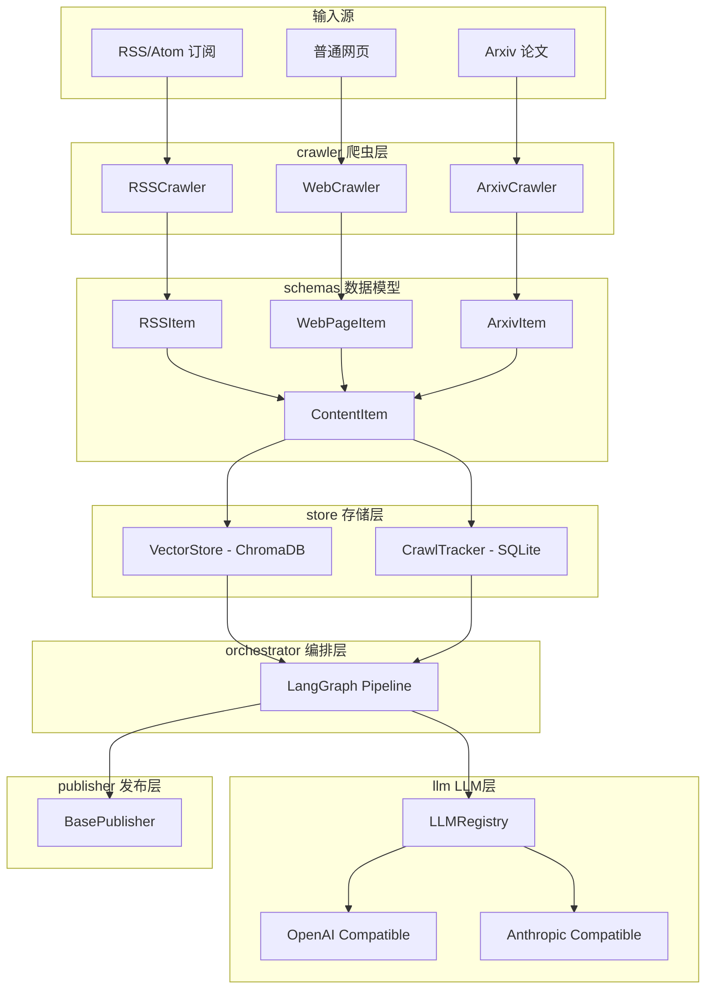

# CompSynth 架构设计

## 简介

CompSynth 是一个内容聚合与发布系统。通过用户订阅的链接（RSS、普通网页、Arxiv等），每次运行时检查内容更新，将多个订阅源的内容整合分析后推送至媒体平台，同时持久化数据避免重复爬取和内容丢失。

## 系统架构



## 数据流

```
订阅源配置 → Crawler.fetch() → list[ContentItem]
    → CrawlTracker.deduplicate() → list[ContentItem] (新内容)
    → VectorStore.add() (持久化)
    → LLM.summarize() → 聚合报告
    → Publisher.publish() → 发布结果
```

## 模块设计

### 1. schemas - 数据模型

**职责：** 定义所有内容项的结构化数据模型（Pydantic）

**核心模型：**

| 模型 | 说明 | 关键字段 |
|------|------|----------|
| `ContentItem` | 基础内容项 | source, url, title, content, published_at, collected_at, metadata |
| `ArxivItem` | Arxiv论文 | arxiv_id, authors, abstract, categories |
| `RSSItem` | RSS订阅 | feed_title, feed_url, summary |
| `WebPageItem` | 普通网页 | description, site_name |

**路径：** `src/comp_synth/schemas/`

### 2. crawler - 爬虫层

**职责：** 从各类订阅源采集内容，输出结构化的 ContentItem

**接口：**

```python
class BaseCrawler(ABC):
    async def fetch(self, source_config: dict) -> list[ContentItem]
```

**实现：**
- `RSSCrawler` - 基于 feedparser 解析 RSS/Atom 订阅源
- `WebCrawler` - 基于 httpx + readability-lxml 提取网页正文
- `ArxivCrawler` - 基于 Arxiv RSS/API 采集论文信息

**路径：** `src/comp_synth/crawler/`

### 3. llm - LLM 封装层

**职责：** 注册表模式管理多个 LLM provider，统一接口

**接口：**
```python
class LLMRegistry:
    def register(self, name: str, provider_config: dict) -> None
    def get(self, name: str) -> BaseChatModel
```

**支持的 Provider：**
- OpenAI Compatible（通过 langchain-openai 的 ChatOpenAI）
- Anthropic Compatible（通过 langchain-anthropic 的 ChatAnthropic）

**路径：** `src/comp_synth/llm/`

### 4. store - 存储层

**职责：** 内容持久化、去重追踪、语义检索

**组件：**

| 组件 | 后端 | 功能 |
|------|------|------|
| `VectorStore` | ChromaDB | 内容向量存储、语义搜索、TTL过期清理 |
| `CrawlTracker` | SQLite | 爬取记录、去重判断、状态管理 |

**路径：** `src/comp_synth/store/`

### 5. orchestrator - 编排层

**职责：** 使用 LangGraph 编排完整的内容聚合流水线

**流水线节点：**
```
fetch_sources → deduplicate → summarize → publish
```

**状态定义：**
```python
class PipelineState(TypedDict):
    sources: list[dict]           # 订阅源配置
    raw_items: list[ContentItem]  # 原始采集内容
    new_items: list[ContentItem]  # 去重后的新内容
    report: str                   # LLM生成的聚合报告
    publish_results: dict         # 发布结果
    errors: list[str]             # 错误记录
```

**路径：** `src/comp_synth/orchestrator/`

### 6. publisher - 发布层

**职责：** 将聚合报告发布到目标媒体平台

**接口：**
```python
class BasePublisher(ABC):
    async def publish(self, report: str, config: dict) -> dict
```

**路径：** `src/comp_synth/publisher/`

### 7. config - 配置管理

**职责：** 基于 Pydantic Settings 的集中配置管理，从 `.env` 文件加载

**配置项分类：**
- 路径配置：log_dir, data_dir
- LLM 配置：api_key, base_url, default_model
- 存储配置：chroma_persist_dir, crawl_db_path, vector_ttl_days
- 爬虫配置：request_timeout, max_concurrent_requests

**环境变量前缀：** `COMPSYNTH_`

**路径：** `src/comp_synth/config.py`

### 8. logging - 日志系统

**职责：** 基于 Loguru 的统一日志管理

**日志文件：**
- `app_{YYYYMMDD}.log` - 全量日志（DEBUG+）
- `error_{YYYYMMDD}.log` - 错误日志（ERROR+，含堆栈）

**路径：** `src/comp_synth/logging/`

## 技术选型

| 领域 | 选型 | 理由 |
|------|------|------|
| 包管理 | uv | 快速、现代的 Python 包管理器 |
| 数据模型 | Pydantic v2 | 验证、序列化、LangChain 生态兼容 |
| 配置管理 | pydantic-settings | 类型安全的 .env 配置加载 |
| HTTP客户端 | httpx | 原生异步支持 |
| 网页提取 | readability-lxml | 类似 Firefox Reader View 的正文提取 |
| RSS解析 | feedparser | Python RSS 解析的标准库 |
| LLM框架 | LangChain | 统一的 LLM 抽象层 |
| 流程编排 | LangGraph | 基于状态图的灵活工作流 |
| 向量数据库 | ChromaDB | 嵌入式、零部署、支持元数据过滤 |
| 爬取追踪 | SQLite | 轻量、零配置、适合本地状态管理 |
| 日志 | Loguru | 简洁 API、异步写入、自动轮转 |
| 代码质量 | ruff + isort + pre-commit | 统一代码风格 |

## 难点分析与解决方案

### 1. 普通网页的结构化内容提取

**方案：** 分层提取策略
1. `httpx` 获取原始 HTML
2. `readability-lxml` 提取主体正文（去除导航、广告等干扰元素）
3. `BeautifulSoup` 进行精细化解析（如有需要）
4. 对于 JS 渲染的页面，后续可引入 Playwright

### 2. 媒体平台发布

**方案：** 插件化架构
- 定义 `BasePublisher` 抽象接口
- 每个目标平台实现独立的 Publisher 子类
- 通过配置决定启用哪些发布渠道

## 目录结构

```
src/comp_synth/
├── __init__.py
├── config.py
├── logging/
│   ├── __init__.py
│   └── logger_config.py
├── schemas/
│   ├── __init__.py
│   ├── base.py
│   ├── arxiv.py
│   ├── rss.py
│   └── web.py
├── crawler/
│   ├── __init__.py
│   ├── base.py
│   ├── rss_crawler.py
│   ├── web_crawler.py
│   └── arxiv_crawler.py
├── llm/
│   ├── __init__.py
│   ├── registry.py
│   └── providers.py
├── store/
│   ├── __init__.py
│   ├── vector_store.py
│   └── crawl_tracker.py
├── orchestrator/
│   ├── __init__.py
│   ├── graph.py
│   ├── nodes.py
│   └── state.py
└── publisher/
    ├── __init__.py
    └── base.py
```
